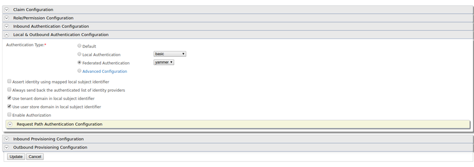

# Configuring Yammer Authenticator

This page provides instructions on how to configure the Yammer authenticator and WSO2 Identity Server using a sample app. You can find more information in the following sections.  

 ````
 This is tested for the Yammer API version 1.0. Yammer Authenticator is supported by WSO2 Identity Server versions 5.1.0, 5.2.0, 5.3.0, 5.4.0 and 5.4.1. 
 ````
 
* [Deploying Yammer artifacts](#deploying-yammer-artifacts)
* [Configuring the Yammer App](#configuring-the-yammer-app)
* [Deploying travelocity.com sample app](#deploying-travelocitycom-sample-app)
* [Configuring the identity provider](#configuring-the-identity-provider)
* [Configuring the service provider](#configuring-the-service-provider)
* [Testing the sample](#testing-the-sample)

### Deploying Yammer artifacts

1. Place the authenticator .jar file into the <IS_HOME>/repository/components/dropins directory. You can download the
 .jar(org.wso2.carbon.identity.authenticator.yammer) file from the [WSO2 Store](https://store.wso2.com/store/assets/isconnector/details/0e1f0ba7-c4dc-4826-afa7-ba3adef00e7b). 
 
 > If you want to upgrade the Yammer Authenticator in your existing WSO2 Identity Server pack, please refer [upgrade instructions](https://docs.wso2.com/display/ISCONNECTORS/Upgrading+an+Authenticator).
 
 ### Configuring the Yammer App
 
 1. Log in to [Yammer](https://www.yammer.com/wso2.com/?show_login=true#/home?show_login=true) using your account credentials.
 
 2. Register a new application in [https://www.yammer.com/client_applications](https://www.yammer.com/client_applications). 
 
    
 
 3. Fill in the form provided to add your application. 
 
    
 
 Fill in the following required fields and click **Continue**:
 
 * **Application name**: The name of your application
 * **Organization**: The organization that the app represents.
 * **Support e-mail**: The email address used to communicate with the app.
 * **Website**: The website represented by the app.
 * **Redirect URI**: Use [https://localhost:9443/commonauth](https://localhost:9443/commonauth) as the **Redirect URI** 
 when you register the app. This is an important step.
  
 4. Obtain the Client ID and the Client Secret that were generated for your application via the App Dashboard. 
 
    
  
### Deploying [travelocity.com](https://www.travelocity.com/) sample app

Next, [deploy the sample app](https://docs.wso2.com/display/ISCONNECTORS/Deploying+the+Sample+App) in order to use it in this scenario.

Once this is done, configure the WSO2 Identity Server by adding an [identity provider](https://docs.wso2.com/display/IS510/Configuring+an+Identity+Provider) and [service provider](https://docs.wso2.com/display/IS510/Configuring+a+Service+Provider).

### Configuring the identity provider

Now you have to configure WSO2 Identity Server by [adding a new identity provider](https://docs.wso2.com/display/IS510/Configuring+an+Identity+Provider).

1. Download the WSO2 Identity Server from [here](https://wso2.com/identity-and-access-management) and [run it](https://docs.wso2.com/display/IS510/Running+the+Product).

2. Log in to the [management console](https://docs.wso2.com/display/IS510/Getting+Started+with+the+Management+Console) as an administrator.

3. In the **Identity Providers** section under the **Main** tab of the management console, click **Add**.

    1. Give a suitable name for Identity Provider Name. 
    
        
    
4. Next, navigate to the **Federated Authenticators > Yammer Configuration**. 
   1. Select the **Enable** and **Default** checkboxes. This will enable the Yammer authenticator and make it the 
   default Identity provider. 
   2. Enter the following values and click **Register**. 
   
   | Field| Description | Sample Values |
   | ------------- |-------------| ---------------|
   | Client ID | This is the client ID that wasgenerated for the application you registered via Yammer.| sGdyjvdPadOTAvYc7SZOg |
   | Client Secret | This is the client secret that wasgenerated for the application you registered via Yammer. |AV0acZHX1fPhJdk5VhTdCW6utt0hP7FHxOb72Gznqo|
   | Callback URL | This is the service provider's URL to which the code is sent to. |[https://localhost:9443/commonauth](https://localhost:9443/commonauth) |

 
 
 You have now added the identity provider.
 
 ### Configuring the service provider
 
 The next step is to configure the service provider.
    
   1. Return to the management console.
   
   2. In the **Service Providers** section, click **Add** under the **Main** tab.
   
   3. Since you are using travelocity as the sample, enter [travelocity.com](https://www.travelocity.com/) in the 
   **Service Provider Name** text box and click **Register**. 
        
        1. In the **Inbound Authentication Configuration** section, click **Configure** under the **SAML2 Web SSO 
        Configuration** section. 
        
        2. Now set the configurations as follows: 
            1. **Issuer**: [travelocity.com](https://www.travelocity.com/) 
            2. **Assertion Consumer URL**: [http://localhost:8080/travelocity.com/home.jsp](http://localhost:8080/travelocity.com/home.jsp)
        
        3. Select the following check-boxes:
            1. Enable Response Signing
            2. Enable Single Logout
            3. Enable Attribute Profile
            4. Include Attributes in the Response Always 
        
        4. Click **Register** to save the changes.
            
        
        5. Now you will be sent back to the **Service Providers** page. 
            1. Navigate to the **Local and Outbound Authentication Configuration** section.
            2. Select the identity provider you created from the dropdown list under **Federated Authentication**.
            3. Ensure that the **Federated Authentication** radio button is selected and click **Update** to save the 
            changes. 
            
                
        
        You have now added and configured the service provider.
            
### Testing the sample

1. To test the sample, go to the following URL: http://<TOMCAT_HOST>:<TOMCAT_PORT>/travelocity.com/index.jsp 

    E.g. [http://localhost:8080/travelocity.com](http://localhost:8080/travelocity.com)

2. Click “Login with SAML” to log in with SAML from the WSO2 Identity Server.

    

3. Enter your Yammer credentials in the prompted login page to login. Once you log in successfully you will be taken 
to the home page of the [travelocity.com](https://www.travelocity.com/) app. 

    